# Oleksii Silveistruk — Portfolio

Personal portfolio and business-card site: projects, research, skills and experience, built from my CV and portfolio deck.
It's a lightweight **Preact + Vite** app (~11 KB gzipped JS for visitors) with a **backend-less admin panel**: content edits are committed straight to this repository through the GitHub API, and GitHub Pages redeploys the site automatically.

**Live:** https://alexmaster168.github.io/card-site.github.io/

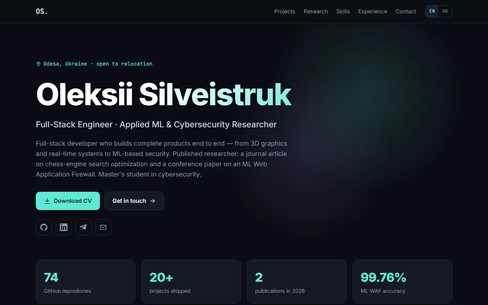

## Features

- **EN / UA** interface. The language is detected from the browser and can be switched in the header.
- **Selected projects**: cards with screenshots, tech stack and links to code and live demos. Each card opens a modal with a gallery that also works with the keyboard (← → Esc).
- **Research & publications** with key metrics, plus skills, an experience timeline, education and contacts.
- A **Download CV** button that serves the PDF from `public/cv.pdf`.
- **Admin panel** at `#/admin`. It lets me add, edit, reorder and delete projects, upload images (resized to WebP in the browser), edit the profile and upload a new CV. A raw JSON editor covers everything else. There is a live preview, and **Publish** commits all changes at once.
- Scroll-reveal animations that respect `prefers-reduced-motion`. The layout is responsive and has no horizontal scroll at 390 px.

## Screenshots

### Projects
Featured projects get large cards with a cover image, tagline, stack and links.

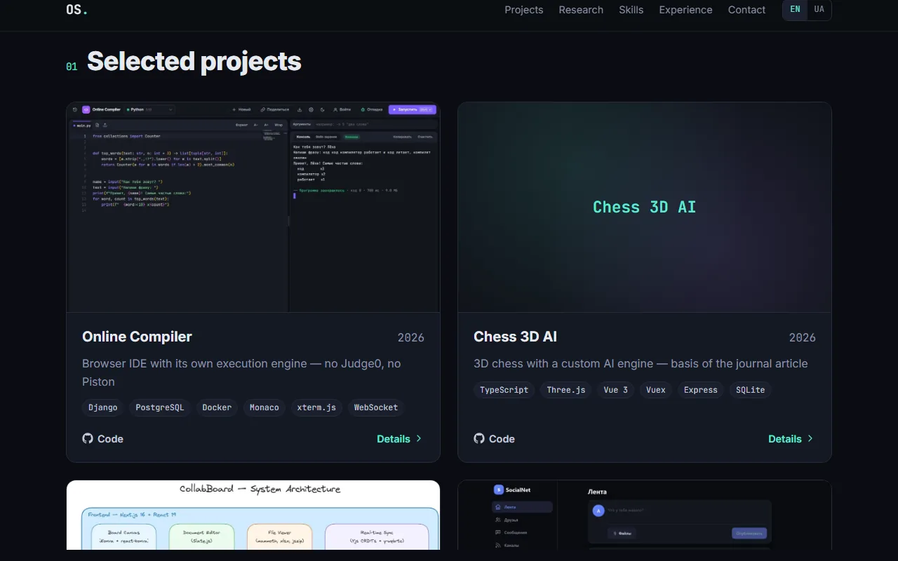

Smaller projects go into a compact "More from GitHub" grid.

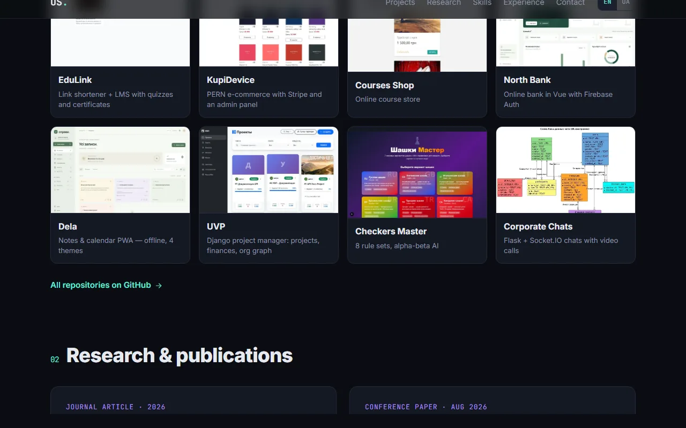

### Project details
A modal with an image gallery, full description, tech stack and links.

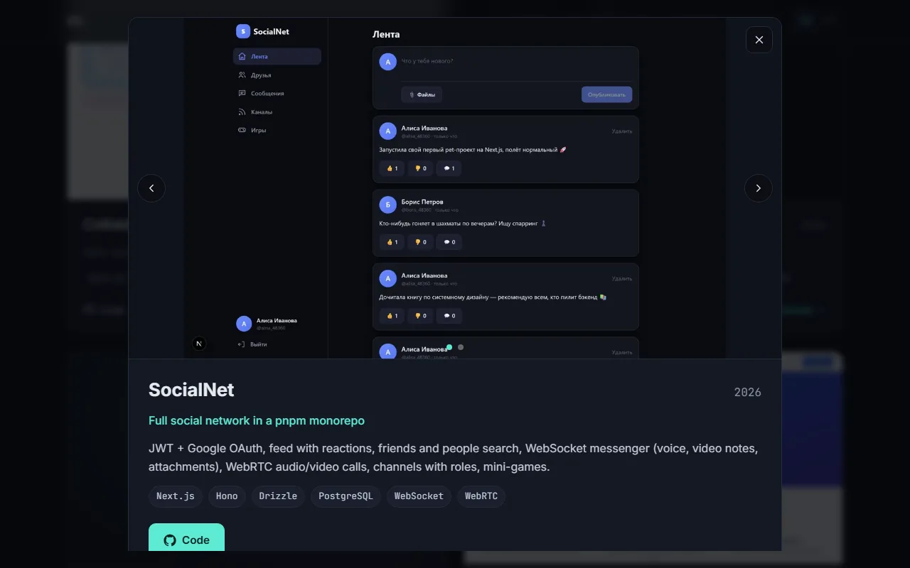

### Research & publications
A journal article and a conference paper, each with headline metrics.

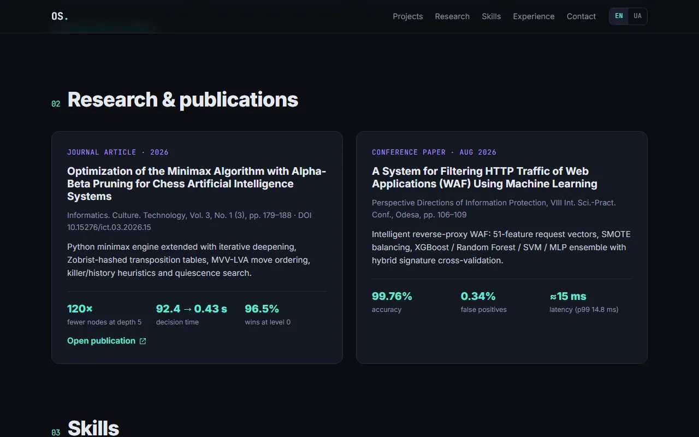

### Skills
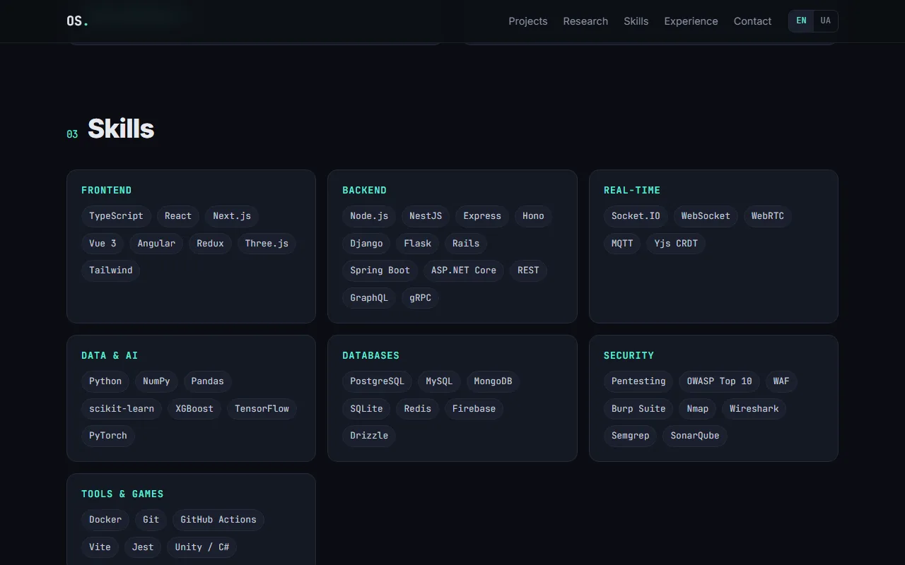

### Experience & education
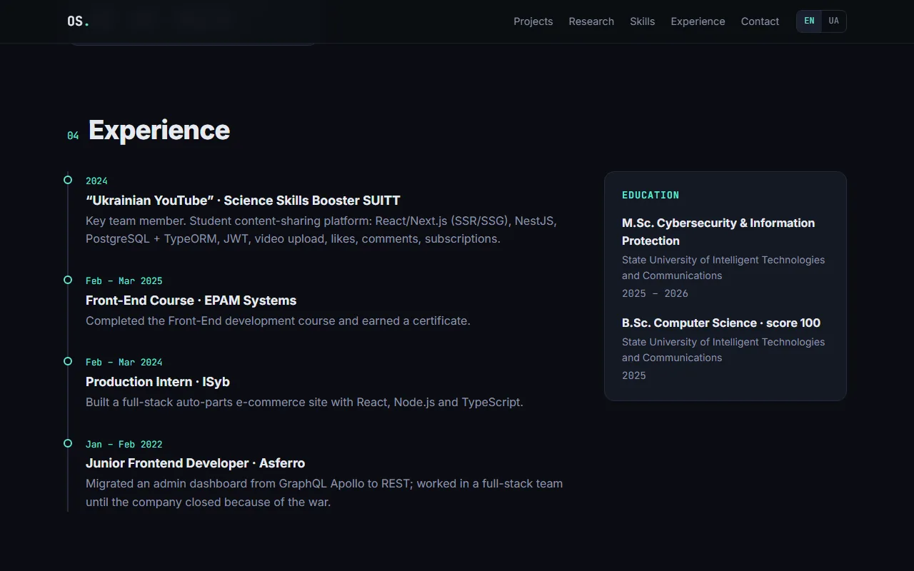

### Mobile
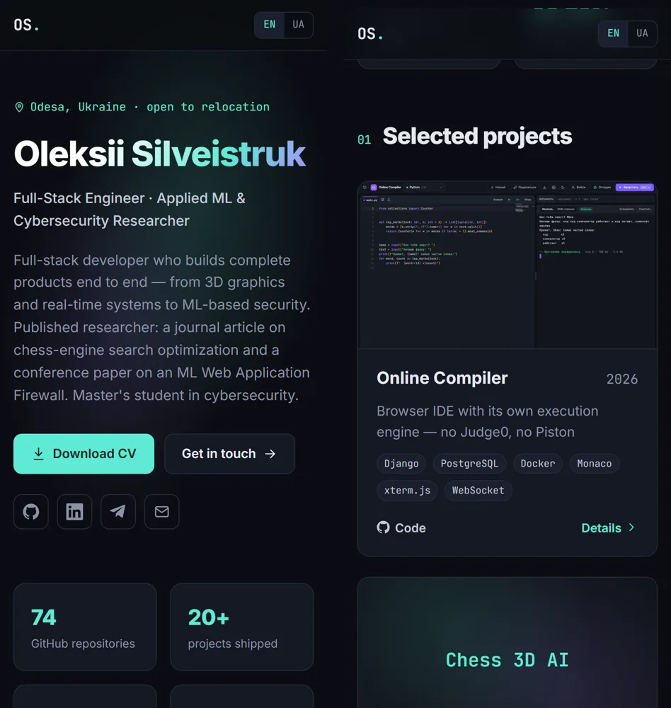

### Admin: login
The login and password are never stored anywhere. They are used to derive the key that decrypts the GitHub token.

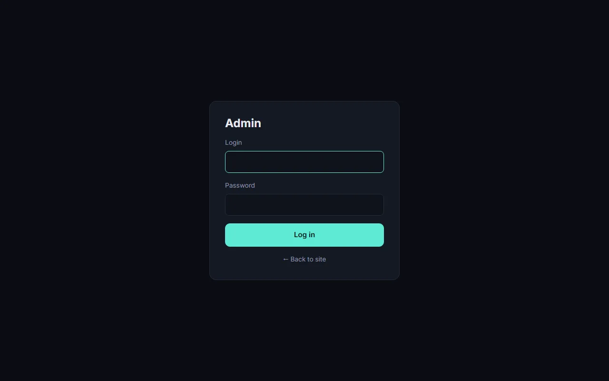

### Admin: projects
Reorder, edit, delete, add. The order in this list is the order on the site.

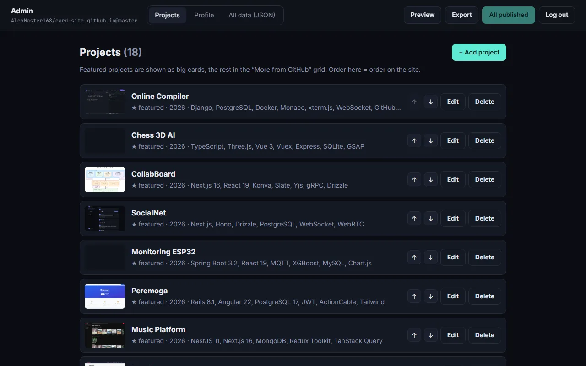

### Admin: project editor
Fields for both languages, an image uploader (the first image is the cover), and a "featured" toggle that switches between a big and a compact card.

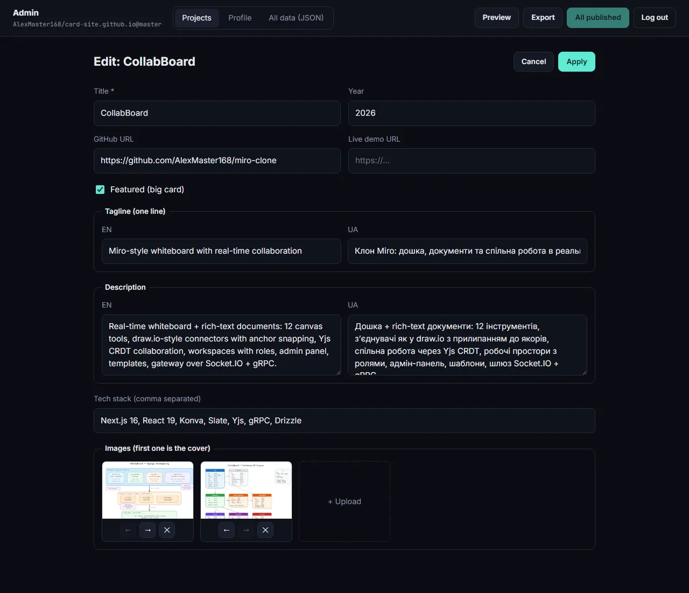

### Admin: all data (JSON)
Stats, skills, publications, experience and education are all edited here.

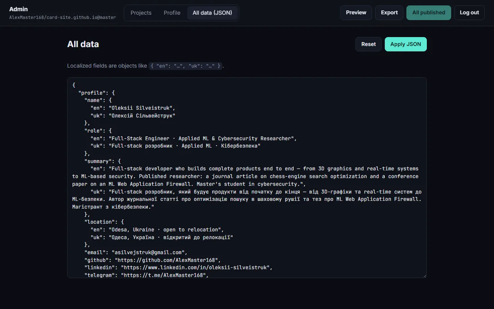

## Tech stack

| Part | Tech |
|---|---|
| UI | Preact 11 (hooks), plain CSS |
| Build | Vite 8 |
| Content | `public/data.json` |
| Admin auth | Web Crypto: PBKDF2-SHA256 (600k iterations) → AES-256-GCM |
| Admin storage | GitHub Git Data API: one atomic commit per publish |
| Hosting | GitHub Pages via GitHub Actions |

## Getting started

```bash
npm install
npm run dev       # http://localhost:5173
npm run build     # production build in dist/
```

## How the admin works (no backend)

1. A fine-grained GitHub token with write access to this repo is **encrypted** with a key derived from `login + password` (PBKDF2, 600,000 iterations) and saved to `src/admin/secret.json`.
2. On `#/admin` you enter the login and password. The browser derives the key and decrypts the token. If either value is wrong, AES-GCM refuses to decrypt. No password hash is stored anywhere.
3. Edits stay local until you press **Publish**. The admin then creates one commit containing `public/data.json` and any uploaded files.
4. The push triggers the GitHub Actions workflow, and the site is live again in about a minute.

The admin code is a separate chunk, so regular visitors never download it. The decrypted token lives only in memory and is gone after a page reload or logout.

### One-time setup

1. **Create a token:** GitHub → Settings → Developer settings → *Fine-grained tokens* → Generate.
   - Repository access: **Only select repositories** → `card-site.github.io`
   - Permissions: **Contents → Read and write** (nothing else)
   - Expiration: whatever you're comfortable with (generate a new secret when it expires)
2. **Encrypt it:**
   ```bash
   npm run admin:secret
   ```
   Enter a login, a **strong password (12+ characters, ideally a long passphrase)** and the token. This writes `src/admin/secret.json`.
3. **Enable Pages via Actions:** repo → Settings → Pages → Source: **GitHub Actions**.
4. Commit and push. Then open `https://alexmaster168.github.io/card-site.github.io/#/admin`.

To change the password or rotate the token, run `npm run admin:secret` again and push.

### Security notes

- `secret.json` is public, like everything else in a static site. Its protection is the password. PBKDF2 with 600k iterations makes each guess slow, but **a weak password can still be brute-forced offline**, so use a long one.
- The token is scoped to this one repository with contents permission only. Even if it leaks, the worst case is someone editing this site. You can revoke it at any time on GitHub, and git history keeps every previous version of the content.

## Project structure

```
public/
  data.json            # all site content (edited by the admin)
  projects/, uploads/  # project screenshots
  cv.pdf
src/
  site/                # public site: sections, project modal, icons
  admin/               # admin panel (lazy-loaded chunk)
    crypto.js          # PBKDF2 + AES-GCM seal/unseal (shared with the CLI script)
    github.js          # atomic multi-file commits via the Git Data API
    secret.json        # encrypted token
  lib/                 # data loading, i18n, scroll reveal
scripts/make-secret.mjs
.github/workflows/deploy.yml
```
